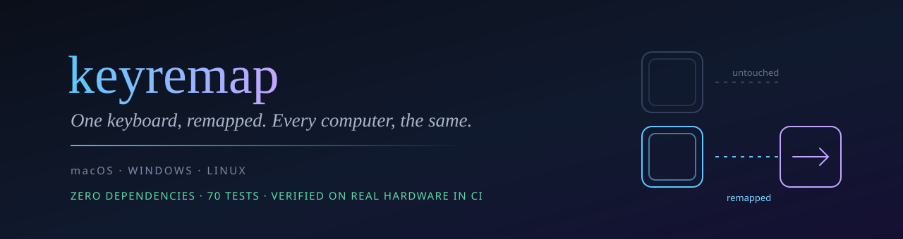
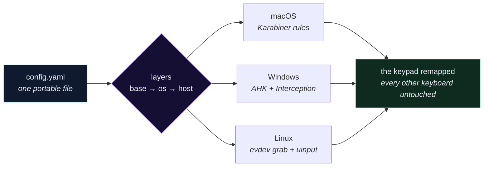
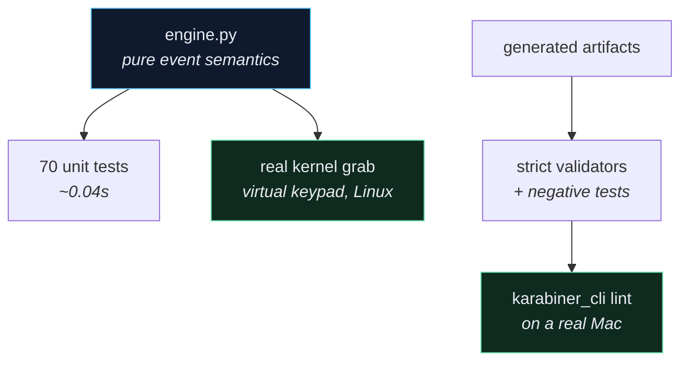

<div align="center">



[](https://github.com/fire17/keyremap/actions/workflows/ci.yml)
[](tests/test_keyremap.py)
[](#-quickstart)
[](.github/workflows/ci.yml)
[](LICENSE)
[](https://github.com/fire17/keyremap/stargazers)

*Your keypad should mean the same thing on every machine you carry it to.*

**[⚡ Quickstart](#-quickstart)** · **[🧠 Why this is hard](#-the-part-that-should-stop-you)** · **[⚙️ Config](#️-config)** · **[🖥️ Control room](#️-the-control-room-tui)** · **[🔬 How it's verified](#-how-its-verified)**

</div>

---

## 🧠 The part that should stop you

**Two keyboards can send byte-identical keystrokes.** Press Home on a Bluetooth keypad and on a
laptop's built-in keyboard: same virtual key (`0x24`), same scancode (`0x47`), same flags. Nothing
in the keystroke says which keyboard it came from — so "remap only the keypad" is not a
configuration problem, it's an interception problem.

- **The evidence is in this repo's history.** A raw-input capture of both keyboards pressing Home
  produced identical events; only the device handle differed.
- **Bluetooth-LE devices report `VID/PID` as `0x0000`** to the Interception driver, so the textbook
  `GetKeyboardId(vid, pid)` lookup fails *and pops a modal dialog before your `try` can catch it*.
  keyremap matches on the device **handle** instead.
- **No reboot, even after installing a kernel filter driver.** Restarting just the target device
  (`pnputil /restart-device`) attaches the filter to that device alone — your built-in keyboard
  never receives it, so it cannot be affected.
- **CI proves the hard parts on real hardware**: Karabiner's own linter accepts the generated rule
  on a real Mac, and on a real Linux kernel a virtual keypad is created, grabbed, and the
  *remapped* events are read back.

> [!IMPORTANT]
> One config file describes your device by its hardware id. Carry the keypad to another computer,
> run one command, and it behaves identically — Ctrl on Windows and Linux becomes ⌘ on macOS
> automatically.

---

## ⚡ Quickstart

```sh
curl -fsSL https://raw.githubusercontent.com/fire17/keyremap/HEAD/install.sh | sh
keyremap selftest     # proves the install is sound on THIS machine
keyremap apply        # build, deploy, and switch it on
```

On macOS that last command does the whole job: it writes the rule, installs it where Karabiner
reads it, **and enables it in your selected profile** — no clicking through the Karabiner UI.
Your existing rules are preserved, re-running never duplicates, and your `karabiner.json` is
backed up first. (CI proves all three on a real Mac.)

> [!NOTE]
> Each OS reads a device's vendor/product id through a different stack, and if they disagree the
> rule matches nothing — a silent failure that looks like success. If `selftest` says your device
> isn't matching, `keyremap adopt` lists what *this* machine reports and rewrites just those two
> lines in your config, leaving comments and layers untouched.

Then type `keyremap` for the control room, or `keyremap gui` for the desktop app.
No pip, no venv, no dependencies — everything is Python standard library, **including the YAML
reader**.

<details>
<summary><b>Windows, and taking your setup to another computer</b></summary>

**Windows**: clone and run `windows-tools\keyremap-launch.cmd`, or use WSL — keyremap detects WSL
and drives the Windows side over `powershell.exe` interop automatically.

**Moving machines** — the whole migration is two commands:

```sh
keyremap export                      # writes keyremap-<host>.keyremap
keyremap import keyremap-*.keyremap  # on the other computer
```

Your existing config is backed up, never overwritten.

</details>

---

## 🔌 How it works



| Platform | Mechanism | Reboot? |
|---|---|---|
| **macOS** | generated Karabiner-Elements rules (`device_if` on vendor/product id) | no |
| **Windows / WSL** | AutoHotkey v2 + AutoHotInterception (Interception driver) | no — restart just the device |
| **Linux** | evdev grab + uinput re-emit (live daemon) | no |

---

## ⚙️ Config

Layers merge **base → os:*platform* → host:*hostname***; later wins per key, `null` removes an
inherited mapping.

```yaml
version: 2

devices:
  keypad:
    match: { vendor_id: 0x045E, product_id: 0x0040, name_contains: "Keypad" }

profiles:
  base:                      # everywhere — this is what travels
    keypad:
      esc: home
      pagedown: lctrl        # a key can BE a modifier (held, not tapped)
      end: accel+v           # accel = Ctrl on Win/Linux, ⌘ on macOS
      home:
        tap: accel+a         # on release, if released quickly
        hold: [accel+a, accel+c]   # at the threshold, still held
        hold_ms: 400

  os:
    darwin:
      keypad: { esc: escape }    # only on macOS
  host:
    tamis-mac:
      keypad: { tab: null }      # only on that machine
```

| Field | Fires |
|---|---|
| [`press`](#️-config) | immediately on key-down (the default for a plain `key: target` line) |
| [`tap`](#️-config) | on release — only if released before `hold_ms` |
| [`hold`](#️-config) | at the `hold_ms` mark while still held; suppresses `tap` |

Any of them may be a **list**, which runs as a sequence. That is how "tap = select all, hold =
select all **and** copy" works: seeing the selection appear *late* is your proof the copy ran too.

<details>
<summary><b>Finding a key's real code (never guess a scancode)</b></summary>

In the TUI press **3** then **s**, or run `keyremap listen 30`, then press the key. Real numbers
captured from a Bluetooth keypad:

| Key | Code | Note |
|---|---|---|
| Home / End | `0x147` / `0x14F` | E0-extended |
| PgUp / PgDn | `0x149` / `0x151` | E0-extended |
| Ins / Del | `0x152` / `0x153` | E0-extended |

AutoHotInterception marks E0-extended with `0x100` — not `0x200`. Guessing this silently produces
a script that does nothing.

</details>

---

## 🖥️ The control room (TUI)

`keyremap` with no arguments. Five panes, one keystroke apart, hot-reloading the config the moment
you save it, and idling at ~0% CPU because the loop blocks in `select()`.

```
 1 Dashboard  2 Mappings  3 Capture  4 Doctor  5 Apply ──────────────────────────

  Device
  configured        keypad
  fingerprint       keypad → usb:045e:0040
  present           Bluetooth Keypad

  Profile layers
    ● base
    ○ os:darwin  (not this machine)

  effective         10 mappings
```

- **Mappings** — every effective mapping *and the layer it came from*, so you always know why a key
  does what it does.
- **Capture** — live keystrokes tagged with their source device.
- **Doctor** — per-platform checks that name the exact fix command.
- **Apply** — builds, deploys, and records what was deployed.

`keyremap gui` opens the same thing as a desktop window — native tkinter, with a zero-dependency
browser UI as a first-class fallback so no machine is left without a GUI.

---

## 🔬 How it's verified

The part that can actually be *wrong* is the decision logic — what a press, release, repeat or hold
should emit. It lives in `engine.py` as a pure function of events, so it is tested exhaustively
anywhere; the Linux backend is a thin shell around it, and Windows/macOS delegate the same contract
to AutoHotkey timers and Karabiner's `to_if_alone` / `to_if_held_down`.



**Every push runs on real macOS, Linux and Windows runners**, and three jobs go further:

- **`fresh-machine journey`** runs what a new user actually types, on a real Mac and a real
  Linux box: `./install.sh` → `keyremap check` → `doctor` → `selftest` → `export`/`import` →
  `apply`, then asserts the rule is **live in Karabiner's profile**, that a re-install preserves
  an edited config, and that uninstalling leaves nothing behind. (This job found a broken
  install on its very first run — see the defects table.)

- **`karabiner lint (real macOS)`** installs Karabiner-Elements and runs **its own**
  `karabiner_cli --lint-complex-modifications` against the generated rule, then installs it into
  `~/.config/karabiner/assets/complex_modifications/` and re-lints from there. If `karabiner_cli`
  is missing, the job **fails** rather than quietly passing.
- **`real kernel grab (Linux)`** modprobes `uinput`, creates a genuine virtual keypad carrying the
  configured vendor/product id, lets keyremap grab it, injects keys and asserts the remapped events
  come back out — simple remap, held modifier, and tap-vs-hold at the threshold. Observed output:

  ```
  virtual keypad: /dev/input/event2  vendor=0x045E
  detected: keyremap test keypad -> ['kp']
  ✓ ESC -> HOME on a real kernel device
  ✓ PAGEDOWN held as LEFTCTRL, released cleanly
  ✓ quick tap -> ctrl+a only
  ✓ hold -> ctrl+a then ctrl+c, at the threshold
  ALL LIVE KERNEL CHECKS PASSED
  ```

Two more nets catch what logic tests cannot: **Karabiner's own key-code vocabulary is vendored**
(206 upstream codes; all 124 keyremap can emit are checked against it), and the **validators have
negative tests proving they fail** on an invented `key_code`, a manipulator with no `device_if`
(which would silently remap *every* keyboard on a Mac), an AHK `Map.Delete` on a state map, and
`GetKeyboardId()` on a Bluetooth device.

```sh
python3 -m unittest discover -s tests -v     # 70 tests, ~0.04s
keyremap selftest                            # generate + validate for ALL platforms
```

<details>
<summary><b>Defects this process caught (the honest list)</b></summary>

Each of these shipped-looking-fine and was found by *running* the thing, not by review:

| Defect | Found by | Would have caused |
|---|---|---|
| missing `import time` | fake-kernel test | Linux daemon crashing on its first loop |
| `SystemExit` in library code | CI on Ubuntu | `selftest` exiting 1 instead of reporting a missing dep |
| config unreadable without `pyyaml` | running on native Windows Python | **a fresh Mac failing to load a valid config** |
| `UnicodeEncodeError` on `✓` | native Windows console | every status report crashing |
| `import` wrote YAML into `.json` | round-trip test | an unreadable config after migrating machines |
| `Map.Delete` on an absent key (AHK v2) | live use | one key silently dead while all others worked |
| keypad auto-repeat restarting hold timers | live use | hold actions never firing |
| install.sh shipping a stale file list | fresh-machine CI | **every command crashing on a new machine** |
| `OWNER/keyremap` left in the install URL | fresh-machine CI | the README's one-liner 404-ing for everyone |
| `SRC` set but `$SRC_DIR` read | fresh-machine CI | a clone install silently going to the network |

</details>

---

## 🛟 Safety and undo

| What | Where | Undo |
|---|---|---|
| App files | `~/.keyremap/app` | `rm -rf ~/.keyremap/app` |
| Launcher | `~/.local/bin/keyremap` | `rm ~/.local/bin/keyremap` |
| Your config | never overwritten — existing config is backed up on import | restore the `.bak-*` file |
| macOS rule | `~/.config/karabiner/assets/complex_modifications/keyremap.json` | delete it, or disable the rule in Karabiner |
| Windows driver | Interception (installed separately, by you) | `install-interception.exe /uninstall` |

Nothing is installed system-wide, and no key is remapped on any device other than the one your
config names.

---

## ⭐ If this saved you an afternoon

This project exists because "just remap the keypad" turned out to be three operating systems, a
kernel filter driver, and seven bugs that only appeared when the code actually ran. If that story
is useful to you, a star is how it finds the next person carrying a keypad between machines.

<sub>[★ star history](https://star-history.com/#fire17/keyremap&Date) — the chart appears once
there is history to chart.</sub>

---

**License**: [MIT](LICENSE).

<div align="center">
<sub><i>Built with Claude Code. Every number in this README was observed, not estimated.</i></sub>
</div>
